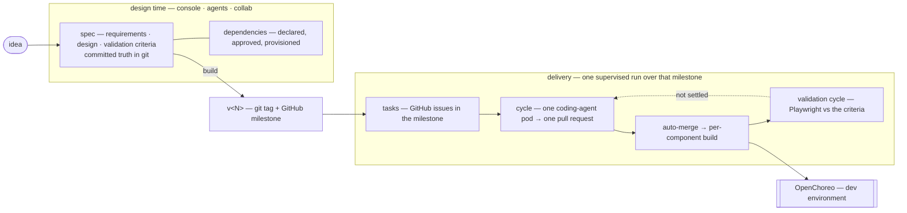

# WSO2 Labs: Agentic Engineer

> 🧪 **Early lab project** — APIs, data models, and features are still evolving,
> and subsystems may change shape between commits. Try it, break it, tell us what
> you think — just don't build on it as a stable surface yet.

Repository: [`wso2/labs-agentic-engineer`](https://github.com/wso2/labs-agentic-engineer)

An experimental, open-source platform that explores what **agent-driven software
engineering** looks like when the agents work inside an enterprise platform instead
of a blank editor. It's an early WSO2 lab project, built on top of
[OpenChoreo](https://github.com/openchoreo/openchoreo) and shared in the spirit of
"let's see what works."

## The premise

Agentic coding tools have made greenfield code generation fast and accessible. But
enterprise software isn't bottlenecked on typing — it's bottlenecked on requirements,
integrations, identity, deployment, and architectural conformance. The bet behind
this project is that to push productivity further, agents need to operate **inside a
platform that already understands those concerns**, so they can produce systems that
slot into the existing ecosystem rather than ignore it.

OpenChoreo already handles API management, identity, deployments, observability, and
policy enforcement. The agents in this repo build on that foundation, so what they
produce lands in an environment that enforces enterprise concerns automatically.

## What the platform does

It treats the SDLC as a chain of stages — **Specification → Design → Implementation
→ Build → Deploy → Manage** — and gives each stage a specialized agent with only the
tools and skills it needs. The flow:

- A **business owner** describes the solution they want; a chat agent guides
  requirements elicitation.
- A **shared workspace** lets BAs, designers, and engineers collaborate on the same
  artifacts, each with a view suited to them.
- Everything is captured as **spec files in a Git repository** (`specs/requirements/`,
  `specs/design/`, wireframes, domain models). Those specs become the contract
  downstream agents work against.
- Coding agents pick up tasks from those specs, work via **GitHub issues + branches
  + PRs** (no merge without human review), and the platform watches webhooks to drive
  each task through `pending → in_progress → ready_for_review → merged → building → deployed`.
- Because agents share context across artifacts, the system stays internally
  consistent — change a requirement and the wireframes, design, and tasks move with it.

## Demo

https://github.com/user-attachments/assets/9723e5a5-c187-49b5-886e-50c217da6c28

## The model



Skills are how the platform is taught rather than changed.

## Running the platform

There are two deployment paths:

| | **Local dev** | **Existing OC cluster** |
|---|---|---|
| How | Skaffold + k3d | `aectl platform install` |
| Entry point | `make dev-cluster` | `aectl platform install` |
| Who | contributors | platform engineers |

### Local dev (Skaffold)

The whole platform runs on one laptop: a k3d cluster with OpenChoreo, Thunder
(identity), Temporal, and the AEP services deployed in-cluster via Helm +
Skaffold. Coding agents run as ephemeral OC Job Components. Full details in
[`deployments/`](deployments/README.md).

**Container runtime.** Docker Desktop or Colima, sized generously — the cluster
runs the OpenChoreo control/data/workflow planes, Thunder, and Temporal alongside
the AEP services. Colima wants at least `--cpu 7 --memory 8`, plus several GB of
free disk for the coding-agent runner image.

**CLI tools.** `docker` (with buildx), `k3d`, `kubectl`, `helm`, `skaffold`,
`jq`, `yq`, `openssl`, `curl`.

**Credentials.** An Anthropic API key and a GitHub PAT (or GitHub App). Neither
is needed to bring the platform up — you connect both from the console
afterwards, and they're stored per organization.

**Free ports.** The cluster's k3d loadbalancer claims `6550`, `8080`, `8443`,
`19080`, `19443`, `10081`, `10082`. Additional service NodePorts: `9090`
(aep-api), `4000` (agents), `3401` (aep-mcp-server), `8233` (Temporal Web UI).

### Bring it up

Three steps, with different lifecycles:

```bash
# Once per machine — creates the k3d cluster with OC, Thunder, Temporal
bash deployments/scripts/setup-dev.sh

# Once per cluster — registers secrets, Thunder OAuth clients, resource-type catalog
make setup-local

# Every dev session — builds images, loads into k3d, deploys via Helm, watches for changes
make dev-cluster
```

`setup-dev.sh` creates the k3d cluster, installs the platform underneath
(cert-manager, External Secrets, kgateway, OpenBao, then OpenChoreo's control,
data and workflow planes, Thunder for identity, Temporal for the run supervisor).
Expect it to take a while on a cold machine — chart installs and image pulls.
It is idempotent, so if a step fails you fix the cause and re-run it.

`make setup-local` registers Kubernetes secrets, Thunder OAuth clients, and the
PE resource-type catalog (postgres, thunder-app) that the Helm chart needs.

`make dev-cluster` (Skaffold) builds the AEP service images, loads them into the
k3d node, deploys via the platform Helm chart, and watches for file changes to
rebuild and redeploy. Coding agents run as ephemeral OC Job Components dispatched
into the cluster, not as long-lived services.

Observability is off by default because it's the heaviest install. Add it on top
of an existing cluster with `aectl sre install` — installs OpenSearch, Fluent Bit,
and the RCA agent needed for in-UI live progress streaming and the
[SRE handoff pipeline](docs/developer-guide/sre-handoff-runbook.md).

### Accessing the portal

The console is at **http://console.openchoreo.localhost:8080**. Sign in as
`admin` / `admin` — the Thunder default admin, which setup binds to OpenChoreo's
`admin` role. Login redirects through `thunder.openchoreo.localhost`, so if your
OS doesn't resolve `*.localhost`, point those names at `127.0.0.1` in `/etc/hosts`.

Before the first project, connect the organization's credentials in the console —
both are per-org, which is why bring-up doesn't ask for them:

- **Settings → GitHub Integration** — the PAT (or GitHub App) that specs,
  component repos, issues and PRs are created under.
- **Settings → Anthropic Integration** — the key every agent turn and coding run
  is billed to. There is no platform fallback, so nothing generates until it's
  connected.

GitHub webhooks — the ones that drive a merged PR through build and deploy —
need a smee.io channel configured in the git-ignored
`deployments/helm-charts/platform/values.local.dev.yaml` override file. See that
file's comments (copy from `values.local.dev.yaml.example`).

Other surfaces worth knowing: the BFF at `localhost:9090`, the Temporal Web UI at
`localhost:8233` for the run workflows, and OpenChoreo's Argo UI in the workflow
plane for build and coding-agent pods.

Tear down the cluster with `bash deployments/scripts/delete-dev.sh`, which drops
all OpenChoreo and Temporal state.

### Installing on an existing OpenChoreo cluster (aectl)

For platform engineers installing AEP on a cluster that already has OpenChoreo
running, use the `aectl` CLI:

```bash
# Build the CLI
cd tools/aectl && go build -o aectl .

# Install AEP onto the current kubecontext
aectl platform install
```

`aectl platform install` installs the AEP Helm chart, provisions OpenBao, and
registers Thunder OAuth clients — the same outcome as the Skaffold path but
without the k3d cluster setup or Skaffold watch loop. The CLI source lives in
[`tools/aectl/`](tools/aectl/AGENTS.md).

## Where the code lives

| Path | What it is |
|---|---|
| [`apps/console`](apps/console/README.md) | the human surface: React SPA over the BFF, its only backend |
| [`services/aep-api`](services/aep-api/README.md) | the Go BFF — seven domains behind one tenant-gated edge; owns spec git, the milestone run supervisor (Temporal), provisioning, and the GitHub webhook plane |
| [`services/agents`](services/agents/AGENTS.md) | design-time agent runtime (Vercel AI SDK). One turn = one POST, streamed as SSE; writes no files itself |
| [`services/collab`](services/collab/AGENTS.md) | Yjs server hosting the live spec document, one room per project |
| `services/aep-mcp-server` | MCP surface letting external agents (OpenChoreo's SRE/RCA agent) search issues, file one, and dispatch a coding run |
| [`runners/`](runners/AGENTS.md) | `remote-worker`, the coding agent: a one-shot pod running the Claude Agent SDK. One image serves implementation and validation; its ADRs are in `runners/remote-worker/design/decisions/` |
| [`skills/`](skills/AGENTS.md) | the one authored skill library, seeded and reconciled into every org's own repo |
| [`packages/`](packages/contracts/AGENTS.md) | shared libraries. `packages/contracts` holds the hand-authored OpenAPI every client and server is generated from |
| [`playground/`](playground/AGENTS.md) | a cluster-free harness that runs the real agents against a plain local directory — how the skills and prompts get tuned |
| [`evals/spec-agents`](evals/spec-agents/README.md) | scenario evals for the design-time agents. On demand, never in CI |
| [`deployments/`](deployments/README.md) | the local stack: k3d + OpenChoreo + AEP services deployed in-cluster via Skaffold |


## Status and feedback

This is an **early lab project**, and the whole point of putting it out now is to
learn from people working through similar problems: where agent boundaries should
sit, how skills map to your conventions, what felt natural, what got in the way.
Feedback goes via GitHub issues on
[`wso2/labs-agentic-engineer`](https://github.com/wso2/labs-agentic-engineer).

## License

Apache 2.0 — see [`LICENSE`](./LICENSE).
